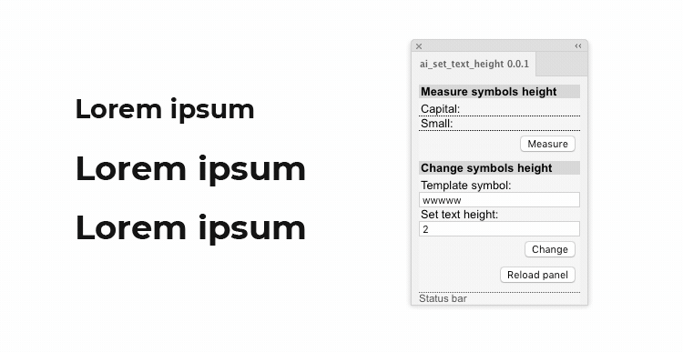

HTML/CSS/JS Extension Panel для Adobe Illustrator CC+
===

 

## Возможности
* Измерение высоты определенного строчного символа выделенного текстового блока.
* Изменение высоты всех символов выделенного текстового блока.
* Кегль шрифта вычисляется по заданному значению высоты в мм.
* Пропорционально изменяется межстрочный интервал и смещение базовой линии.
* Остальные параметры форматирования символов сохраняются.   

## Установка
Скачайте и распакуйте архив с файлами расширения. Перенесите единой папкой в место расположения всех расширений Adobe и перезапустите Иллюстратор.
### Windows
* Для всех пользователей
`C:\Program Files (x86)\Common Files\Adobe\CEP\extensions`
* Для конкретного пользователя
`C:\Users\имя пользователя\AppData\Roaming\Adobe\CEP\extensions`

### Mac OS
`/Library/Application Support/Adobe/CEP/extensions`   
Как быстро перейти к папке: нажать `Shift + ⌘ + G`, вставить данный адрес в поле и нажать `Go/Перейти`.   

> Если в Иллюстраторе панель расширения окажется пустой, то нужно включить режим отладки. [Инструкция для активации](https://medium.com/@jordanslon/kak-ustanovit-zxp-d4e3e639b27b) для обоих операционных систем.

## Использование
* Для измерения высоты символов выделите один текстовый объект
  * поддерживается выделение как в режиме объекта, так и в текстовом режиме
* Нажмите кнопку `Measure`:
  * в поле `Capital: ` появится значение высоты заглавной буквы шрифта в мм
  * в поле `Small: ` отобразится значение высоты строчной буквы в мм
* Для того, чтобы задать свою высоту, введите значение в мм в поле `Set text height`
* Нажмите `Change`
* В случае успеха в строке состояния высветится `Idle`
* В случае ошибки в строке состояния высветится название ошибки.   

При создании расширения использовались строки кода из скрипта 'X-height Size.jsx' автора Wolfgang Reszel (ai-js@rumborak.de)  

Иконки для панели нарисованы [Sergey Osokin](https://github.com/creold)

